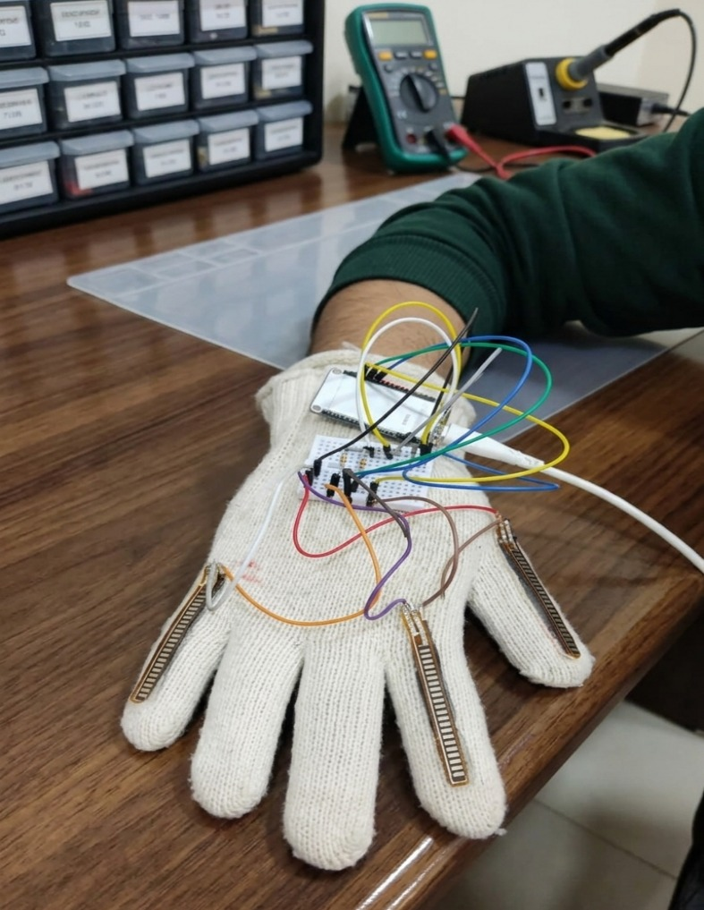
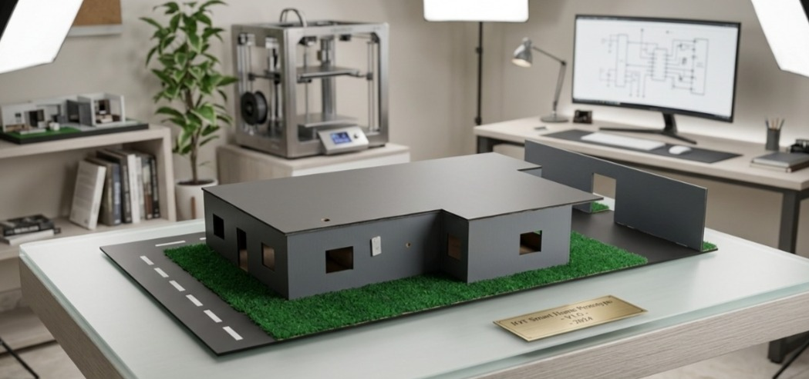

# 🏠🧤 Smart Home Controlled by Smart Gloves

> **B.Sc. Graduation Project — Mechatronics Engineering**
> Benha National University, Faculty of Engineering — Academic Year 2025/2026
> **Grade: A+**

A wearable gesture-recognition glove that wirelessly controls home appliances — lights, door lock, curtain, and fan — using finger-bending gestures detected by flex sensors, with no internet connection or router required.

---

## 📸 Photos & Poster

<table>
  <tr>
    <td align="center">
      <br/>
      <sub><b>Smart Glove Unit</b></sub>
    </td>
    <td align="center">
      <br/>
      <sub><b>Smart Home Unit</b></sub>
    </td>
  </tr>
</table>

<p align="center">
  <br/>
  <sub><b>Graduation Project Poster — Benha National University 2025/2026</b></sub>
</p>


---

## 📌 Table of Contents

- [Overview](#overview)
- [System Architecture](#system-architecture)
- [Hardware Components](#hardware-components)
- [Wiring & Pin Assignments](#wiring--pin-assignments)
- [Gesture-to-Command Mapping](#gesture-to-command-mapping)
- [Firmware Setup](#firmware-setup)
- [How It Works](#how-it-works)
- [Bill of Materials](#bill-of-materials)
- [Project Structure](#project-structure)
- [Authors](#authors)
- [License](#license)

---

## Overview

This project implements a two-unit embedded system:

| Unit | Role |
|---|---|
| **Smart Glove** | Worn on the hand; reads 3 flex sensors → classifies finger bending → sends Wi-Fi command |
| **Smart Home** | Fixed control box; receives command → actuates light, door lock, curtain, or fan |

The two units communicate **directly over Wi-Fi** (ESP32 Access Point mode) — **no router, no internet, no cloud** required.

Three flex sensors produce a **3-bit binary code** (8 combinations: `000` → `111`), each mapped to a unique home automation command.

---

## System Architecture

```
┌─────────────────────────────┐        Wi-Fi (AP/STA)        ┌──────────────────────────────────┐
│        SMART GLOVE          │ ◄──────────────────────────► │         SMART HOME               │
│                             │    Direct ESP32-to-ESP32     │                                  │
│  Flex Sensor 1 (Thump)      │    No router needed          │  💡 220V Lamp    (Relay)         │
│  Flex Sensor 2 (Index)   ──►│  ESP32 Station Mode          │  🔒 Door Lock    (SG90 Servo)    │
│  Flex Sensor 3 (Pinky)      │                              │  🪟 Curtain      (DC Motor)      │
│  3.7V Li-ion Battery        │                              │  🌀 Fan + LED    (BLDC Fan)      │
│  ESP32 + Boost Converter    │                              │  ESP32 Access Point              │
└─────────────────────────────┘                              └──────────────────────────────────┘
```

---

## Hardware Components

### Smart Glove Unit

| Component | Specification |
|---|---|
| Microcontroller | ESP32 Development Board |
| Flex Sensors | 3× Resistive flex sensors (2.2-inch) |
| Pull-down Resistors | 3× 10 kΩ |
| Battery | 3.7V Li-ion 18650 Cell |
| Power Regulation | 5V Boost Converter Module (e.g. MT3608) |
| Switch | On/Off Slide Switch (optional) |
| Base | Fabric glove |

### Smart Home Unit

| Component | Specification |
|---|---|
| Microcontroller | ESP32 Development Board |
| Relay | 5V **2-Channel** Relay Module (Fan + Lamp) |
| Servo | SG90 Micro Servo Motor (Door) |
| Curtain Motor | DC Motor + Driver (e.g. L298N) |
| Power Supply | Dual-output 12V / 5V AC-DC Module |
| AC Loads | 220V Fan + 220V Light Bulb |

---

## Wiring & Pin Assignments

### Smart Glove — Voltage Divider Circuit (per sensor)

```
3.3V ---[ FLEX SENSOR ]---+---[10kΩ]--- GND
                          |
                      ESP32 ADC PIN
```

> When the finger is **BENT** → flex resistance ↑ → ADC voltage **HIGH** → classified as **0**
> When the finger is **EXTENDED** → flex resistance ↓ → ADC voltage **LOW** → classified as **1**

### Smart Glove — ESP32 Pin Map

| Signal | ESP32 Pin | Mode |
|---|---|---|
| Flex Sensor — Thumb | GPIO 39 (ADC1_CH3) | Analog Input (input-only pin) |
| Flex Sensor — Index | GPIO 34 (ADC1_CH6) | Analog Input (input-only pin) |
| Flex Sensor — Pinky | GPIO 32 (ADC1_CH4) | Analog Input |
| Status LED (onboard) | GPIO 2 | Digital Output |
| Power (from boost converter) | VIN / 5V pin | Power |
| Ground | GND | Ground |

> ⚠️ GPIO 39 and GPIO 34 are **input-only** pins on the ESP32 — do not connect them to outputs.

### Smart Home — ESP32 Pin Map

| Signal | ESP32 Pin | Mode | Notes |
|---|---|---|---|
| Relay CH1 — Fan (220V) | GPIO 33 | Digital Output | Active-LOW relay |
| Relay CH2 — Lamp (220V) | GPIO 25 | Digital Output | Active-LOW relay |
| DC Motor IN1 (Curtain open) | GPIO 19 | Digital Output | |
| DC Motor IN2 (Curtain close) | GPIO 18 | Digital Output | |
| SG90 Servo (Door) | GPIO 26 | PWM Output | |
| Onboard Heartbeat LED | GPIO 2 | Digital Output | Blinks every 1 s |
| Power (from 5V supply) | VIN / 5V pin | Power | |
| Ground | GND | Ground | |

### 2-Channel Relay Module Wiring

```
ESP32 GPIO 33 ──→ Relay IN1 ──→ [COM1]─[NO1] ──→ 220V Fan  (series with Live wire)
ESP32 GPIO 25 ──→ Relay IN2 ──→ [COM2]─[NO2] ──→ 220V Lamp (series with Live wire)
5V Rail       ──→ Relay VCC
GND           ──→ Relay GND
```

> ⚠️ **Relay logic:** Most 2-channel relay modules are **active-LOW** — sending `LOW` energises the relay (device ON), `HIGH` releases it (device OFF). This is already handled in the firmware via `#define RELAY_ON LOW`.

> ⚠️ **Safety:** The relay switches a **220V AC circuit**. All mains wiring must be insulated and enclosed. Never work on the 220V side while powered.

---

## Gesture-to-Command Mapping

Each flex sensor is classified as **0 = BENT** or **1 = EXTENDED**.
Bit order: **[Thumb — Index — Pinky]**

| Binary Code | Thumb | Index | Pinky | Command |
|:---:|:---:|:---:|:---:|---|
| `000` | Bent | Bent | Bent | 🌀 Fan **ON** |
| `001` | Bent | Bent | Extended | 🌀 Fan **OFF** |
| `010` | Bent | Extended | Bent | 💡 Lamp **ON** |
| `011` | Bent | Extended | Extended | 💡 Lamp **OFF** |
| `100` | Extended | Bent | Bent | 🪟 Curtain **OPEN** |
| `101` | Extended | Bent | Extended | 🪟 Curtain **CLOSE** |
| `110` | Extended | Extended | Bent | 🚪 Door **OPEN** |
| `111` | Extended | Extended | Extended | 🚪 Door **CLOSE** |

---

## Firmware Setup

### Requirements

- [Arduino IDE 2.x](https://www.arduino.cc/en/software)
- [ESP32 Board Support Package](https://docs.espressif.com/projects/arduino-esp32/en/latest/installing.html) by Espressif Systems

### Installing ESP32 in Arduino IDE

1. Open Arduino IDE → **File → Preferences**
2. Add this URL to "Additional Board Manager URLs":
   ```
   https://raw.githubusercontent.com/espressif/arduino-esp32/gh-pages/package_esp32_index.json
   ```
3. Go to **Tools → Board → Boards Manager**, search `esp32`, install **"esp32 by Espressif Systems"**
4. Select board: **Tools → Board → ESP32 Arduino → ESP32 Dev Module**

### Flashing the Smart Home Unit

1. Open `firmware/smart_home/smart_home.ino` in Arduino IDE
2. Set your Wi-Fi credentials in the config section at the top of the file
3. Connect the Smart Home ESP32 via USB
4. Select the correct COM port under **Tools → Port**
5. Click **Upload** ▶

### Flashing the Smart Glove Unit

1. Open `firmware/smart_glove/smart_glove.ino` in Arduino IDE
2. Set the **same Wi-Fi credentials** as the Smart Home unit
3. Connect the Smart Glove ESP32 via USB
4. Upload ▶
5. Open **Serial Monitor** (115200 baud) to view live sensor readings and calibrate thresholds if needed

### Calibration

In `smart_glove.ino`, find the threshold array and adjust values based on your Serial Monitor readings:

```cpp
// Adjust these values based on your sensor calibration
const int THRESHOLD[3] = {2200, 2200, 2200};
// Lower value = sensor reads as BENT, Higher value = STRAIGHT
```

Run with fingers fully straight → note ADC values.
Run with fingers fully bent → note ADC values.
Set threshold at the midpoint.

---

## How It Works

1. **Power on** both units. The Smart Home ESP32 starts broadcasting a Wi-Fi Access Point (`SmartHome_AP`).
2. The Smart Glove ESP32 connects to that network automatically on boot.
3. The glove continuously reads the 3 flex sensors at ~20 ms intervals.
4. Each sensor is classified as bent (`1`) or straight (`0`) against a calibrated threshold.
5. The 3 bits form a code `0`–`7`. If the code changes (debounced), the glove sends:
   ```
   HTTP GET http://192.168.4.1/cmd?val=N
   ```
6. The Smart Home ESP32's web server receives the command and actuates the corresponding device.
7. A response is returned to acknowledge receipt.

**Total end-to-end latency:** ~55 ms for relay/fan/LED, ~310 ms for servo, ~2.5 s for full curtain travel.

---

## Bill of Materials

> Prices in Egyptian Pounds (EGP) — actual component costs for this project.

| Component | Qty | Unit Price (EGP) | Total (EGP) |
|---|:---:|:---:|:---:|
| ESP32 Development Board | 2 | 300 | 600 |
| Flex Sensors (2.2-inch) | 3 | 850 | 2,550 |
| 10 kΩ Resistors | 3 | 1 | 3 |
| 18650 Li-ion Cell | 4 | 60 | 240 |
| On/Off Switch | 1 | 2.5 | 2.5 |
| Holder + Protection Circuit | 1 | 40 | 40 |
| Relay Module 5V 2-Channel | 1 | 55 | 55 |
| Buck Converter Module (with display) | 1 | 170 | 170 |
| 12V/5A Power Supply Module | 1 | 195 | 195 |
| Power Supply Wiring | 1 | 40 | 40 |
| SG90 Micro Servo Motor | 1 | 115 | 115 |
| Small DC Motor | 1 | 40 | 40 |
| L298N 2A Motor Driver | 1 | 75 | 75 |
| 5V Brushless DC Fan | 1 | 200 | 200 |
| Jumper Wires | 5 | 7.5 | 37.5 |
| 220V Lamp Holder + Bulb | 1 | 50 | 50 |
| Glove (fabric base) | 1 | 50 | 50 |
| Enclosure Box | 1 | 70 | 70 |
| Breadboards | 2 | 35 | 70 |
| **Total** | | | **4,552.5 EGP** |

---

## Project Structure

```
smart-home-smart-gloves/
│
├── firmware/
│   ├── smart_glove/
│   │   └── smart_glove.ino        # Smart Glove ESP32 firmware
│   └── smart_home/
│       └── smart_home.ino         # Smart Home ESP32 firmware
│
├── docs/
│   ├── wiring_guide.md            # Detailed wiring instructions
│   └── graduation_report.pdf      # Full B.Sc. graduation report
│
├── schematics/
│   └── README.md                  # Schematic descriptions & figure references
│
├── .gitignore
├── LICENSE
└── README.md
```

---

## Authors

| Name |
|---|
| Andraws Samoel Sobhy Baskhron Saad |
|Abdelrahman Mohamed Nasser Zaki |
|Mohammed Hussein Ragab |
|Ahmed Diaa Eldin |

**Supervisor:** Prof. / Dr. Dina Hosny El-Nagar
**Institution:** Benha National University — Faculty of Engineering
**Program:** Mechatronics Engineering — B.Sc. Final Year Project, 2025/2026

---

## License

This project is licensed under the MIT License — see the [LICENSE](LICENSE) file for details.

You are free to use, modify, and distribute this project for educational and personal purposes with attribution.
